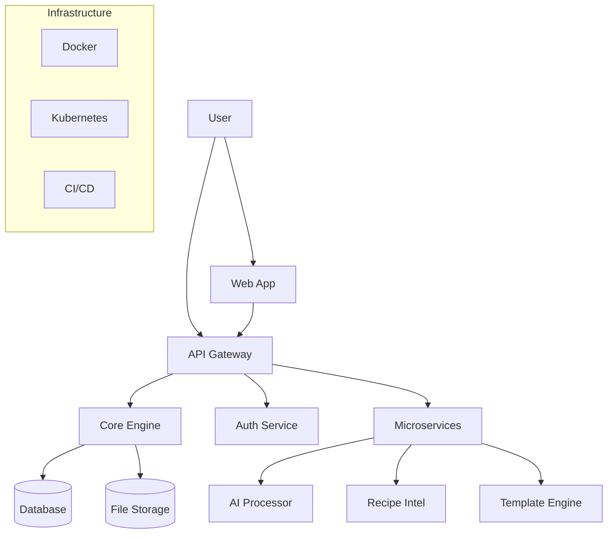
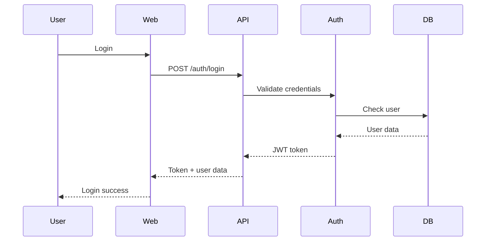

# Architecture Guide

## Overview

Document Generator V2 is a modern monorepo architecture designed for scalability, maintainability, and developer experience.

## System Architecture



## Repository Structure

### Apps (`/apps`)
Deployable applications that serve end users.

```
apps/
├── web/              # React frontend
├── api/              # Express API gateway  
└── admin/            # Admin dashboard
```

**Characteristics:**
- Independent deployment units
- Own package.json and dependencies
- Can import from `/packages`
- Production-ready applications

### Packages (`/packages`)
Shared libraries used across apps and services.

```
packages/
├── core/             # Document processing engine
├── auth/             # Authentication utilities
├── database/         # DB schemas and utilities
└── ui/               # Shared React components
```

**Characteristics:**
- Published as npm packages
- Shared across multiple apps
- Versioned independently
- Well-tested and documented

### Services (`/services`)
Microservices for specific business logic.

```
services/
├── recipe-intel/     # Recipe intelligence
├── ai-processor/     # AI document processing
└── template-engine/  # Template management
```

**Characteristics:**
- Single responsibility
- Independent scaling
- API-first design
- Containerized deployment

### Infrastructure (`/infrastructure`)
DevOps and deployment configurations.

```
infrastructure/
├── docker/           # Docker configurations
├── kubernetes/       # K8s manifests
└── terraform/        # Infrastructure as code
```

## Technology Stack

### Frontend
- **React 18** - UI framework
- **Next.js 14** - Full-stack framework
- **TypeScript** - Type safety
- **Tailwind CSS** - Styling
- **Zustand** - State management

### Backend
- **Node.js 18+** - Runtime
- **Express.js** - Web framework
- **TypeScript** - Type safety
- **Prisma** - Database ORM
- **Redis** - Caching & sessions

### Database
- **PostgreSQL** - Primary database
- **Redis** - Cache & sessions
- **S3** - File storage
- **Elasticsearch** - Search (optional)

### DevOps
- **Docker** - Containerization
- **Kubernetes** - Orchestration
- **Terraform** - Infrastructure
- **GitHub Actions** - CI/CD

### Tooling
- **NPM Workspaces** - Monorepo management
- **Turbo** - Build orchestration
- **ESLint** - Linting
- **Prettier** - Code formatting
- **Jest** - Testing

## Data Flow

### Document Generation Flow
1. User uploads document via Web App
2. Web App calls API Gateway
3. API authenticates request
4. API routes to Core Engine
5. Core Engine processes document
6. Result stored in Database
7. Response returned to user

### Service Communication
- **HTTP APIs** for external communication
- **Event queues** for async processing
- **Database** for shared state
- **Redis** for caching

## Design Principles

### 1. Separation of Concerns
- Apps handle user interaction
- Packages provide shared functionality  
- Services manage business logic
- Infrastructure handles deployment

### 2. API-First Design
- All services expose REST APIs
- OpenAPI specifications
- Versioned endpoints
- Consistent error handling

### 3. Scalable Architecture
- Horizontal scaling support
- Stateless services
- Database connection pooling
- Caching at multiple levels

### 4. Developer Experience
- Single command setup
- Hot reloading in development
- Comprehensive documentation
- Type safety throughout

### 5. Production Ready
- Health checks
- Monitoring & logging
- Error tracking
- Performance optimization

## Security Architecture

### Authentication Flow


### Security Layers
1. **HTTPS** - Transport encryption
2. **JWT** - Stateless authentication
3. **RBAC** - Role-based access control
4. **Rate limiting** - API protection
5. **Input validation** - Data sanitization
6. **Audit logging** - Security monitoring

## Performance Considerations

### Frontend Performance
- Code splitting by route
- Image optimization
- Bundle analysis
- CDN for static assets

### Backend Performance
- Database indexing
- Connection pooling
- Response caching
- Query optimization

### Infrastructure Performance
- Load balancing
- Auto-scaling
- Geographic distribution
- Performance monitoring

## Monitoring & Observability

### Metrics
- Response times
- Error rates
- Throughput
- Resource usage

### Logging
- Structured JSON logs
- Request tracing
- Error aggregation
- Performance insights

### Health Checks
- Application health
- Database connectivity
- External service status
- Resource availability

## Future Considerations

### Planned Enhancements
- GraphQL API layer
- Event-driven architecture
- Machine learning pipeline
- Multi-tenant support

### Scalability Roadmap
- Service mesh (Istio)
- Event sourcing
- CQRS patterns
- Microservice decomposition

This architecture provides a solid foundation for growth while maintaining developer productivity and operational excellence.